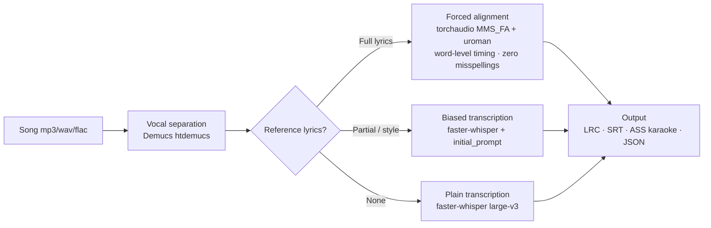
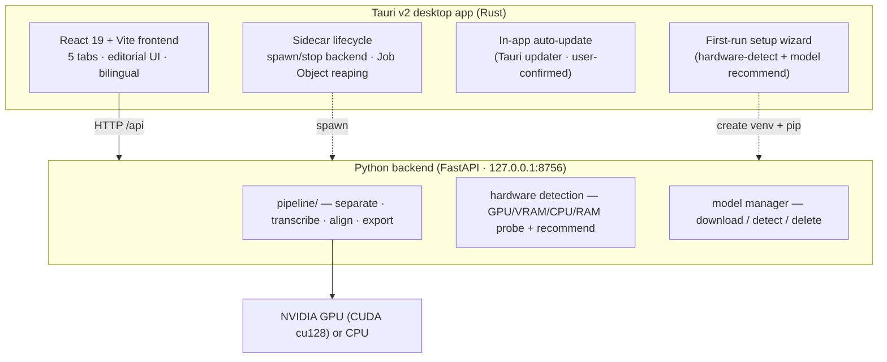
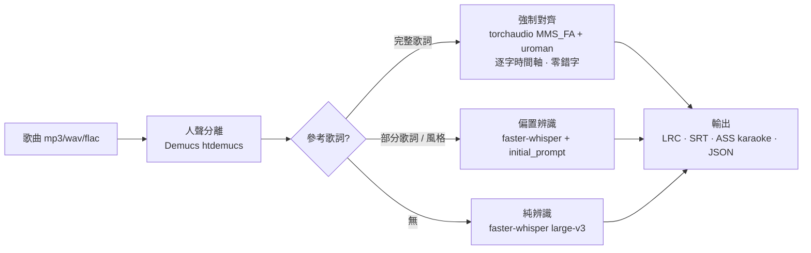
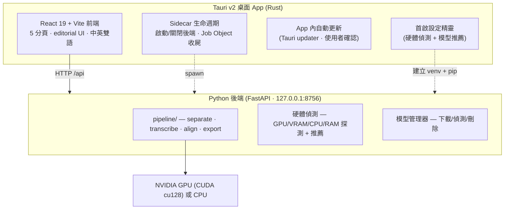

<div align="center">

# 🎵 AutoLyrics · LocalAiLyrics

**Local-first AI singing-lyrics recognition & forced alignment**
**本地端 AI 歌詞辨識與對齊引擎**

Turn any song into **word-level timed lyrics** (LRC / SRT / ASS-karaoke / JSON) — 100% on your own machine. No upload. No account. No tracking.

[](LICENSE)
%20·%20macOS%2FLinux%20(source)-121013)


[](https://github.com/AriesHongHuanWu/LocalAiLyrics/actions/workflows/ci.yml)

**English** · [中文版 ↓](#-中文版)

<!-- demo GIF: docs/assets/demo.gif -->
<!-- HERO GIF (launch gate): drop the ~7s "reading playhead, gold word-sweep" clip at
     docs/assets/demo.gif and uncomment the line below before the public launch.
      -->

**▶ Demo** — _hero GIF coming soon_ (a 7-second clip of the lyric document playing itself, the active word sweeping gold). Until then, [grab a build](https://github.com/AriesHongHuanWu/LocalAiLyrics/releases) and try a song of your own.

</div>

---

## 🇬🇧 What is AutoLyrics?

AutoLyrics ([repo: **LocalAiLyrics**](https://github.com/AriesHongHuanWu/LocalAiLyrics)) is a free, open-source (MIT) **local-first desktop app** that turns any song into **word-level timed lyrics** — LRC (line/word), SRT, **ASS karaoke** (`\k` sweep), or JSON. Everything runs **on your own GPU/CPU**: your audio and your lyrics never leave the machine, there's no cloud upload, no account, and no minute caps.

Songs have backing tracks, held notes and harmonies, so running Whisper directly often produces wrong words and dropped lines. AutoLyrics uses a multi-stage pipeline and treats **the lyrics you already have** as its single biggest accuracy lever.

### Why AutoLyrics

- 🎧 **Local-first & private** — Demucs + faster-whisper + torchaudio run entirely on your machine. Nothing is uploaded; nothing is tracked.
- 🎯 **Reference-lyrics = near-perfect** — paste the **full** lyrics → **forced alignment** only measures *when* each known word is sung (no guessing, zero misspellings). Paste **partial** lyrics or a style hint → **biased transcription**. Paste nothing → plain transcription.
- 🧭 **Smart first-run wizard** — on first launch the setup wizard **detects your hardware** (GPU, VRAM, CPU, RAM, CUDA) and **recommends the right model + device** for your machine, then downloads it for you. Outgrew your old card? Re-run detection any time from Settings.
- 🔄 **In-app auto-update** — the desktop app checks for new releases on startup and updates itself in place (with your confirmation — it never installs silently).
- 🗂️ **Built-in model manager** — download, detect, and delete Whisper models from inside the app; pick a heavier or lighter engine whenever you like.
- 🪄 **Editorial UI** — the lyric document "plays itself": the active word sweeps gold, low-confidence words glow amber, and you can drag any word to retime it.
- 🌏 **Chinese / English / Japanese / Korean / multilingual** — CJK word-level alignment via uroman romanization. UI ships **bilingual (English / 中文)** with a one-click toggle.
- 📤 **Export** LRC (line/word) · SRT · **ASS karaoke** (`\k` sweep) · JSON.

### Recognition pipeline (this is *why* it's more accurate)



| Stage | What it uses | Why |
|---|---|---|
| ① Vocal separation | **Demucs** `htdemucs` | Strip the backing track first — the single biggest accuracy gain ([research](https://arxiv.org/html/2506.15514v1)) |
| ② Speech recognition | **faster-whisper** `large-v3` (also small … large-v3-turbo) | Best open ASR, with word-level timing |
| ③ Reference lyrics | Full / partial / none (see above) | The lyrics or style you paste are applied here |
| ④ Output | LRC / SRT / ASS / JSON | Word-level timing, hand-tunable |

> Measured: same song, same `small` model — **with vs. without vocal separation** is the difference between "first 56 s, 11 lines" and "**full 268 s, 85 lines**".

### Architecture



### Download

Desktop installers live on **[Releases](https://github.com/AriesHongHuanWu/LocalAiLyrics/releases)** (`AutoLyrics_x.y.z_x64-setup.exe` / `.msi`).

- **Windows** — grab the binary from Releases. On first launch the **setup wizard** detects your hardware, recommends a model, builds a local Python environment, and downloads the engine for you (requires Python 3.10–3.12 on your system).
- **macOS / Linux** — build from source (see below). **Help wanted on macOS/Linux packaging** — PRs welcome.

> 💡 The installer is small but "installs more" on first run because CUDA + a Whisper model is 6 GB+ and can't ship inside the installer. This is the industry-standard pattern: a small installer plus a first-run wizard that fetches the engine and model. After that, the app keeps itself current via in-app auto-update.

### Quickstart (run from source)

**Requirements:** Python **3.10–3.12**, Node **20+**, and ideally an NVIDIA GPU. This project is developed on an **RTX 5060 (8 GB, Blackwell sm_120)**, which needs **PyTorch cu128** — the install scripts handle that. Desktop packaging also needs **Rust** (rustup) and, on Windows, the **MSVC "Desktop development with C++"** workload.

```bash
# A) Backend + built-in test UI — fastest way to verify accuracy
cd backend
./install.ps1        # macOS / Linux: ./install.sh — builds .venv, installs cu128 PyTorch + deps
./run.ps1            # serves http://127.0.0.1:8756
# Open http://127.0.0.1:8756, drop in a song, (optionally) paste reference lyrics, pick a mode → go.

# B) Desktop app (dev mode)
cd frontend
npm install
npm run tauri dev    # boots Vite + the backend sidecar and opens the desktop window

# C) Build installers
cd frontend
npm run tauri build  # → src-tauri/target/release/bundle/{nsis,msi}/
```

**CLI end-to-end test:**

```bash
backend/.venv/Scripts/python.exe -X utf8 backend/test_e2e.py "song.mp3" --model large-v3
backend/.venv/Scripts/python.exe -X utf8 backend/test_e2e.py "song.mp3" --lyrics lyrics.txt   # forced alignment
```

### The 5 tabs

| Tab | What it does |
|---|---|
| **Transcribe** | Single-column launcher: drop a file → pick a mode (auto / biased / forced-align) → paste reference lyrics → style chips → run, with 3-stage progress |
| **Editor** | The flagship: the lyric document "plays itself" — the active word renders in 40 px warm-gold serif with a `\k` sweep, low-confidence words pulse amber, and you can grab a word and drag to retime it (snaps to vocal onset) |
| **Export** | Live preview of LRC / SRT / ASS-karaoke / JSON; the ASS sweep animates with playback, so what you see is what you save |
| **Library** | Past runs — reopen or re-export any of them |
| **Settings** | Engine / device, GPU & VRAM readout, **hardware re-detection**, the **model manager** (download / delete), and defaults |

**Design language:** "ink on dark paper" — warm graphite black `#121013` + a single classical gold `#E8C36B` + a semantic trio (gold = now playing / amber = low confidence / green = done), set in Source Serif 4 × Noto Serif CJK (bundled offline).

### Tech stack

| Layer | Tech |
|---|---|
| Vocal separation | Demucs `htdemucs` |
| Speech recognition | faster-whisper (CTranslate2) — large-v3 / medium / small / large-v3-turbo |
| Forced alignment | torchaudio `MMS_FA` + `forced_align` (no compiler needed) + uroman (CJK romanization) |
| Hardware detection | torch / psutil / ctypes probes → model + device recommendation (CPU-safe fallback) |
| Backend API | FastAPI + Uvicorn, threaded job queue |
| Frontend | React 19 · Vite 6 · TypeScript · Zustand · lucide-react · bilingual i18n |
| Desktop shell | Tauri v2 (Rust) + Python sidecar + Windows Job Object + Tauri updater |
| GPU | PyTorch **cu128** (NVIDIA Blackwell / sm_120) |

### Roadmap

- [x] **Phase 1** — Python accuracy engine + FastAPI + built-in test UI
- [x] **Phase 2** — React/Vite flagship frontend (editorial lyric editor, word-level retiming)
- [x] **Phase 3** — Tauri desktop app + Python sidecar (auto start/stop + Job Object reaping) + installers
- [x] **Model manager** — in-app download / detect / delete + first-run model picker
- [x] **First-run hardware-detect wizard** — probes GPU/VRAM/CPU/RAM and recommends a model
- [x] **In-app auto-update** — startup check + user-confirmed install (Tauri updater)
- [ ] Bundle **portable Python** (so even Python is no longer a prerequisite)
- [ ] Advanced engines: HeartTranscriptor / SongTrans (music-specialized SOTA)
- [ ] Cantonese boost: FunASR / Paraformer
- [ ] macOS / Linux signed packaging — **help wanted**

### Contributing

Issues and PRs welcome — see [CONTRIBUTING.md](CONTRIBUTING.md). See also [PRIVACY.md](PRIVACY.md) and [SECURITY.md](SECURITY.md).

### License

[MIT](LICENSE) © 2026 **Aries HongHuan Wu**

---

## 🌏 中文版

[↑ English version](#-what-is-autolyrics)

把任何歌曲變成**字級時間軸**的歌詞(LRC / SRT / ASS-karaoke / JSON),全程在你自己的電腦上跑,**不上傳雲端、不需帳號、不追蹤**。免費開源(MIT)。

AutoLyrics([儲存庫:**LocalAiLyrics**](https://github.com/AriesHongHuanWu/LocalAiLyrics))是一款**本地優先的桌面 App**。歌曲有伴奏、長拖音、和聲,直接丟 Whisper 常常錯字一堆、漏半首。AutoLyrics 用一條**多階段管線**把準確度拉滿,並把**「你已經知道的歌詞」**當成準確度的最大武器。

### ✨ 為什麼選 AutoLyrics?

- 🎧 **本地優先、隱私至上**:Demucs + faster-whisper + torchaudio 全在本機 GPU/CPU 跑,歌曲與歌詞不外傳、不追蹤。
- 🎯 **參考歌詞 = 接近完美**:貼上**完整歌詞** → **強制對齊**只算時間、零錯字;貼**部分歌詞/風格** → **偏置辨識**;什麼都不貼 → 純辨識。
- 🧭 **聰明的首啟精靈**:第一次開啟時,設定精靈會**偵測你的硬體**(GPU、VRAM、CPU、RAM、CUDA)並**推薦最適合的模型與裝置**,再幫你下載。換了新顯卡?隨時可在「設定」重新偵測。
- 🔄 **App 內自動更新**:桌面 App 開啟時會檢查新版本,並在你**確認後**就地更新(絕不靜默安裝)。
- 🗂️ **內建模型管理器**:在 App 內下載/偵測/刪除 Whisper 模型,隨時換更重或更輕的引擎。
- 🪄 **新創 editorial 介面**:歌詞文件會「自己播放」,正在唱的字金色掃過、低信心字琥珀標示,任何字都能抓著拖曳重新對時。
- 🌏 **中 / 英 / 日 / 韓 / 多語**:中文逐字對齊(經 uroman 羅馬化)。介面**中英雙語**,一鍵切換。
- 📤 **匯出** LRC(逐行/逐字)· SRT · **ASS 卡拉OK**(`\k` 掃光)· JSON。

### 🔬 辨識管線(這就是「為什麼比較準」)



| 階段 | 用的東西 | 作用 |
|---|---|---|
| ① 人聲分離 | **Demucs** `htdemucs` | 先把伴奏拿掉 — 單一最大準確度提升([研究實證](https://arxiv.org/html/2506.15514v1)) |
| ② 語音辨識 | **faster-whisper** `large-v3`(及 small…large-v3-turbo) | 開源最佳 ASR,字級時間軸 |
| ③ 參考歌詞 | 見上方三模式 | 你貼的歌詞/風格在這層被用上 |
| ④ 輸出 | LRC / SRT / ASS / JSON | 字級時間,可手動微調 |

> 實測:同一首歌、同 `small` 模型,**有沒有人聲分離**的差別是「前 56 秒 11 行」→「**全曲 268 秒 85 行**」。

### 🏗️ 架構



### 📦 下載

桌面安裝檔在 **[Releases](https://github.com/AriesHongHuanWu/LocalAiLyrics/releases)**(`AutoLyrics_x.y.z_x64-setup.exe` / `.msi`)。

- **Windows**:從 Releases 下載 binary。第一次開啟時,**首啟精靈**會偵測硬體、推薦模型、建立本機 Python 環境並下載引擎(需系統已裝 Python 3.10–3.12)。
- **macOS / Linux**:請從原始碼建置(見下)。**macOS/Linux 打包徵求協助** —— 歡迎 PR。

> 💡 為什麼安裝檔很小卻要「進去再裝」?CUDA + 模型有 6GB+,無法塞進安裝檔 —— 所以採用業界標準:小安裝檔 + 首次啟動精靈下載引擎與模型。之後 App 會透過內建自動更新自己保持最新。

### 🚀 從原始碼執行

**系統需求**:Python **3.10–3.12**、Node **20+**、(建議)NVIDIA GPU。本專案在 **RTX 5060 (8GB, Blackwell sm_120)** 上開發 → Blackwell 需 **PyTorch cu128**,安裝腳本已處理。桌面打包另需 **Rust**(rustup)+ Windows 的 **MSVC「使用 C++ 的桌面開發」**。

```bash
# A) 純後端 + 內建測試 UI(最快驗證準確度)
cd backend
./install.ps1        # macOS / Linux: ./install.sh — 建 .venv、裝 cu128 PyTorch 與相依
./run.ps1            # 啟動 http://127.0.0.1:8756
# 開瀏覽器到 http://127.0.0.1:8756,拖入一首歌、(可選)貼參考歌詞、選風格 → 辨識。

# B) 桌面 App 開發模式
cd frontend
npm install
npm run tauri dev    # 自動起 Vite + 後端 sidecar,開桌面視窗

# C) 打包安裝檔
cd frontend
npm run tauri build  # → src-tauri/target/release/bundle/{nsis,msi}/
```

**CLI 端到端測試:**

```bash
backend/.venv/Scripts/python.exe -X utf8 backend/test_e2e.py "song.mp3" --model large-v3
backend/.venv/Scripts/python.exe -X utf8 backend/test_e2e.py "song.mp3" --lyrics lyrics.txt   # 強制對齊
```

### 🗂️ 介面(5 個明確分頁)

| 分頁 | 內容 |
|---|---|
| **辨識 Transcribe** | 單欄啟動台:拖檔 → 選模式(自動/偏置/強制對齊)→ 貼參考歌詞 → 風格 chips → 執行,3 階段進度 |
| **編輯 Editor** | 招牌:歌詞文件「自己播放」,正在唱的字 40px 暖金襯線 + `\k` 掃光、低信心字琥珀脈動、抓字拖曳重新對時(吸附人聲起音) |
| **匯出 Export** | LRC/SRT/ASS-karaoke/JSON 即時預覽,ASS 掃光隨播放動 = 所見即所存 |
| **紀錄 Library** | 過往辨識紀錄,可重開/重匯出 |
| **設定 Settings** | 引擎/裝置、GPU·VRAM、**硬體重新偵測**、**模型管理器**(下載/刪除)、預設值 |

**設計語言**:「深色紙上的墨」暖石墨黑 `#121013` + 單一古典金 `#E8C36B` + 語意化三色(金=正在播 / 琥珀=低信心 / 綠=完成)+ Source Serif 4 × Noto Serif CJK(離線打包)。

### 🧰 技術棧

| 層 | 技術 |
|---|---|
| 人聲分離 | Demucs `htdemucs` |
| 語音辨識 | faster-whisper(CTranslate2)large-v3 / medium / small / large-v3-turbo |
| 強制對齊 | torchaudio `MMS_FA` + `forced_align`(免編譯器)+ uroman(CJK 羅馬化) |
| 硬體偵測 | torch / psutil / ctypes 探測 → 模型與裝置推薦(CPU 安全後備) |
| 後端 API | FastAPI + Uvicorn,執行緒任務佇列 |
| 前端 | React 19 · Vite 6 · TypeScript · Zustand · lucide-react · 中英雙語 i18n |
| 桌面殼 | Tauri v2(Rust)+ Python sidecar + Windows Job Object + Tauri updater |
| GPU | PyTorch **cu128**(NVIDIA Blackwell / sm_120) |

### 🗺️ 開發路線

- [x] **Phase 1** — Python 準確度引擎 + FastAPI + 內建測試 UI
- [x] **Phase 2** — React/Vite 旗艦前端(editorial 歌詞編輯器、字級重對時)
- [x] **Phase 3** — Tauri 桌面 App + Python sidecar(自動啟停 + Job Object 收屍)+ 安裝檔
- [x] **模型管理器** — App 內下載/偵測/刪除 + 首啟選模型
- [x] **首啟硬體偵測精靈** — 偵測 GPU/VRAM/CPU/RAM 並推薦模型
- [x] **App 內自動更新** — 開啟檢查 + 使用者確認後安裝(Tauri updater)
- [ ] 打包 **portable Python**(連 Python 都免裝)
- [ ] 進階引擎:HeartTranscriptor / SongTrans(音樂專用 SOTA)
- [ ] 粵語強化:FunASR / Paraformer
- [ ] macOS / Linux 簽章打包 —— **徵求協助**

### 🤝 貢獻

歡迎 issue 與 PR!請見 [CONTRIBUTING.md](CONTRIBUTING.md)、[PRIVACY.md](PRIVACY.md)、[SECURITY.md](SECURITY.md)。

### 📄 授權

[MIT](LICENSE) © 2026 **Aries HongHuan Wu**

<div align="center">
<sub>Built with ❤️ for musicians, lyric-video makers, karaoke fans, and language learners.</sub>
</div>
</content>
</invoke>
